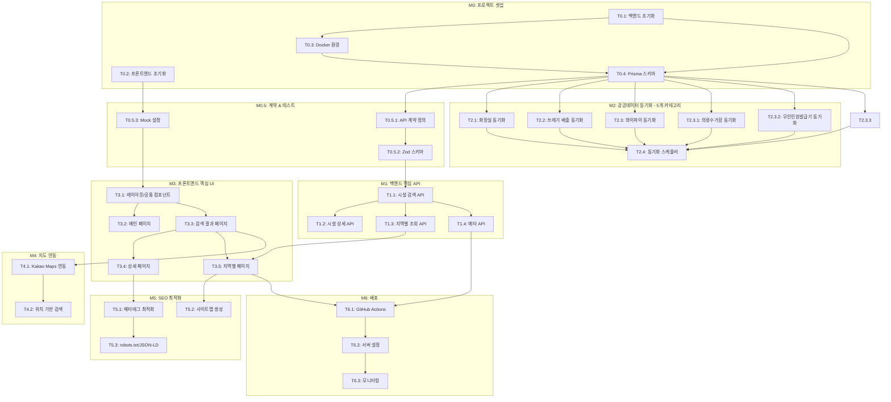

# 06. 개발 태스크 목록 (TASKS)

> 일상킷 - 내 주변 생활 편의 정보, 한 번에 찾기

---

## 마일스톤 개요

| 마일스톤 | 설명 | Phase | 예상 태스크 |
|----------|------|-------|------------|
| M0 | 프로젝트 셋업 | Phase 0 | T0.1 ~ T0.4 |
| M0.5 | 계약 & 테스트 기반 | Phase 0 | T0.5.1 ~ T0.5.3 |
| M1 | 백엔드 핵심 API | Phase 1 | T1.1 ~ T1.4 |
| M2 | 공공데이터 동기화 (6개 카테고리) | Phase 2 | T2.1 ~ T2.4 (T2.3.1~T2.3.3 포함) |
| M3 | 프론트엔드 핵심 UI | Phase 3 | T3.1 ~ T3.5 |
| M4 | 지도 연동 | Phase 4 | T4.1 ~ T4.2 |
| M5 | SEO 최적화 | Phase 5 | T5.1 ~ T5.3 |
| M6 | 배포 & 모니터링 | Phase 6 | T6.1 ~ T6.3 |

---

## 병렬 실행 가능 태스크

| Phase | 병렬 실행 가능 태스크 | 비고 |
|-------|---------------------|------|
| Phase 0 | T0.1, T0.2 | 프론트/백엔드 초기화 동시 가능 |
| Phase 0 | T0.5.1, T0.5.2, T0.5.3 | Mock 설정으로 독립 개발 |
| Phase 1 | T1.1 → T1.2, T1.3, T1.4 | T1.1 완료 후 나머지 병렬 |
| Phase 2 | T2.1, T2.2, T2.3, T2.3.1, T2.3.2, T2.3.3 | **6개 카테고리** 동기화 병렬 가능 |
| Phase 3 | T3.2, T3.3 | Mock API로 UI 병렬 개발 |
| Phase 5 | T5.1, T5.2, T5.3 | SEO 태스크 병렬 가능 |

---

## 의존성 그래프



---

## M0: 프로젝트 셋업

### [x] Phase 0, T0.1: 백엔드 프로젝트 초기화 ✅

**담당**: backend-specialist

**작업 내용**:
- Express + TypeScript 프로젝트 생성
- ESLint, Prettier 설정
- Vitest + Supertest 설정
- 기본 디렉토리 구조 생성

**산출물**:
- `backend/package.json`
- `backend/tsconfig.json`
- `backend/eslint.config.js` (flat config)
- `backend/vitest.config.ts`
- `backend/src/app.ts`

**완료 조건**:
- [x] `npm run dev` 실행 시 서버 시작
- [x] `npm run build` 성공
- [x] `npm run lint` 에러 없음

---

### [x] Phase 0, T0.2: 프론트엔드 프로젝트 초기화 ✅

**담당**: frontend-specialist

**작업 내용**:
- Nuxt 3 프로젝트 생성
- TailwindCSS 설정
- Pinia 설정
- Vitest 설정

**산출물**:
- `frontend/package.json`
- `frontend/nuxt.config.ts`
- `frontend/tailwind.config.js`
- `frontend/app/app.vue`

**완료 조건**:
- [x] `npm run dev` 실행 시 localhost:3000 접속 가능
- [x] TailwindCSS 스타일 적용 확인
- [x] `npm run lint` 에러 없음

---

### [x] Phase 0, T0.3: Docker 환경 설정 ✅

**담당**: backend-specialist

**의존성**: T0.1

**작업 내용**:
- docker-compose.yml 작성 (MySQL 8)
- .env.example 작성
- 초기 DB 접속 테스트

**산출물**:
- `docker-compose.yml`
- `backend/.env.example`

**완료 조건**:
- [x] `docker compose up -d` 실행 성공
- [x] MySQL 접속 가능 (localhost:3307)
- [x] .env.example 문서화

---

### [x] Phase 0, T0.4: Prisma 스키마 및 마이그레이션 ✅

**담당**: database-specialist

**의존성**: T0.3

**작업 내용**:
- Prisma 설치 및 설정
- schema.prisma 작성 (04-database-design.md 기반)
- 초기 마이그레이션 생성
- Seed 스크립트 작성 (Category, Region 초기 데이터)

**산출물**:
- `backend/prisma/schema.prisma`
- `backend/prisma/migrations/`
- `backend/prisma/seed.ts`
- `backend/src/lib/prisma.ts`

**완료 조건**:
- [x] `npm run db:migrate` 성공
- [x] `npm run db:generate` 성공
- [x] Prisma Studio에서 테이블 확인 가능
- [x] Category, Region 초기 데이터 생성됨 (6개 카테고리, 25개 서울 지역)

---

## M0.5: 계약 & 테스트 기반

### [x] Phase 0, T0.5.1: API 계약 정의 ✅

**담당**: backend-specialist

**의존성**: T0.4

**작업 내용**:
- API 엔드포인트 타입 정의
- 요청/응답 인터페이스 작성
- 공유 타입 파일 생성

**산출물**:
- `backend/src/types/api.ts`
- `backend/src/types/facility.ts`
- `backend/src/types/category.ts`
- `backend/src/types/region.ts`
- `frontend/types/api.ts`

**완료 조건**:
- [x] 모든 API 엔드포인트 타입 정의됨
- [x] 프론트/백엔드에서 타입 공유 가능

---

### [x] Phase 0, T0.5.2: Zod 스키마 정의 ✅

**담당**: backend-specialist

**의존성**: T0.5.1

**작업 내용**:
- 시설 검색 요청 스키마
- 시설 상세 조회 스키마
- 지역별 조회 스키마
- 공통 페이지네이션 스키마

**산출물**:
- `backend/src/schemas/facility.ts`
- `backend/src/schemas/search.ts`
- `backend/src/schemas/common.ts`
- `backend/src/middlewares/validate.ts`

**완료 조건**:
- [x] 모든 API 요청에 대한 Zod 스키마 존재
- [x] 유효성 검사 테스트 통과 (62개 테스트)

---

### [x] Phase 0, T0.5.3: 프론트엔드 Mock 설정 ✅

**담당**: frontend-specialist

**의존성**: T0.2

**작업 내용**:
- MSW(Mock Service Worker) 설정
- API Mock 핸들러 작성
- Mock 데이터 fixtures 생성

**산출물**:
- `frontend/mocks/handlers/facilities.ts`
- `frontend/mocks/data/facilities.ts`
- `frontend/mocks/browser.ts`
- `frontend/plugins/msw.client.ts`
- `frontend/public/mockServiceWorker.js`

**완료 조건**:
- [x] 개발 환경에서 MSW 자동 활성화
- [x] Mock API 호출 시 데이터 반환 확인 (14개 테스트)
- [x] `NUXT_PUBLIC_DISABLE_MSW=true`로 비활성화 가능

---

## M1: 백엔드 핵심 API

### [x] Phase 1, T1.1: 시설 검색 API RED→GREEN ✅

**담당**: backend-specialist

**의존성**: T0.5.2

**Git Worktree 설정**:
```bash
# Worktree 생성
git worktree add ../ilsangkit-phase1-search -b phase/1-search
cd ../ilsangkit-phase1-search
```

**TDD 사이클**:

1. **RED**: 테스트 작성 (실패 확인)
   ```bash
   # 테스트 파일: backend/__tests__/routes/facilities.test.ts
   npm run test -- backend/__tests__/routes/facilities.test.ts
   # Expected: FAILED
   ```

2. **GREEN**: 최소 구현 (테스트 통과)
   ```bash
   # 구현 파일: backend/src/routes/facilities.ts
   # 서비스 파일: backend/src/services/facilityService.ts
   npm run test -- backend/__tests__/routes/facilities.test.ts
   # Expected: PASSED
   ```

3. **REFACTOR**: 리팩토링
   - 코드 정리
   - 테스트 유지 확인

**작업 내용**:
- POST /api/facilities/search 엔드포인트
- 키워드 검색, 카테고리 필터
- 위치 기반 검색 (위도/경도 + 반경)
- 페이지네이션

**산출물**:
- `backend/__tests__/routes/facilities.test.ts`
- `backend/src/routes/facilities.ts`
- `backend/src/services/facilityService.ts`

**완료 시 자동 실행**:
```bash
git add -A && git commit -m "$(cat <<'EOF'
기능: 시설 검색 API 구현

- POST /api/facilities/search 엔드포인트 추가
- 키워드, 카테고리, 위치 기반 검색 지원
- 페이지네이션 적용
- TDD 테스트 작성 완료

태스크: Phase 1, T1.1
EOF
)"
git checkout main && git merge phase/1-search --no-ff -m "병합: Phase 1 - 시설 검색 API"
git worktree remove ../ilsangkit-phase1-search && git branch -d phase/1-search
```

**인수 조건**:
- [x] 테스트 먼저 작성됨 (RED 확인)
- [x] 모든 테스트 통과 (GREEN)
- [x] 키워드 검색 동작
- [x] 카테고리 필터 동작
- [x] 위치 기반 검색 동작 (Haversine 공식)
- [x] 페이지네이션 동작

---

### [x] Phase 1, T1.2: 시설 상세 조회 API RED→GREEN ✅

**담당**: backend-specialist

**의존성**: T1.1

**Git Worktree 설정**:
```bash
git worktree add ../ilsangkit-phase1-detail -b phase/1-detail
cd ../ilsangkit-phase1-detail
```

**TDD 사이클**:

1. **RED**: 테스트 작성
   ```bash
   # 테스트 파일: backend/__tests__/routes/facilityDetail.test.ts
   npm run test -- backend/__tests__/routes/facilityDetail.test.ts
   ```

2. **GREEN**: 구현
   ```bash
   # 구현 파일: backend/src/routes/facilities.ts (추가)
   npm run test -- backend/__tests__/routes/facilityDetail.test.ts
   ```

**작업 내용**:
- GET /api/facilities/:category/:id 엔드포인트
- 조회수 증가 로직
- 404 처리

**산출물**:
- `backend/__tests__/routes/facilityDetail.test.ts`
- `backend/src/routes/facilities.ts` (추가)

**완료 시 자동 실행**:
```bash
git add -A && git commit -m "$(cat <<'EOF'
기능: 시설 상세 조회 API 구현

- GET /api/facilities/:category/:id 엔드포인트 추가
- 조회수 증가 로직 구현
- 404 에러 처리

태스크: Phase 1, T1.2
EOF
)"
git checkout main && git merge phase/1-detail --no-ff -m "병합: Phase 1 - 시설 상세 API"
git worktree remove ../ilsangkit-phase1-detail && git branch -d phase/1-detail
```

**인수 조건**:
- [x] 테스트 먼저 작성됨
- [x] 모든 테스트 통과
- [x] 상세 정보 반환
- [x] 조회수 증가
- [x] 존재하지 않는 ID 시 404

---

### [x] Phase 1, T1.3: 지역별 조회 API RED→GREEN ✅

**담당**: backend-specialist

**의존성**: T1.1

**Git Worktree 설정**:
```bash
git worktree add ../ilsangkit-phase1-region -b phase/1-region
cd ../ilsangkit-phase1-region
```

**TDD 사이클**:

1. **RED**: 테스트 작성
   ```bash
   # 테스트 파일: backend/__tests__/routes/facilityRegion.test.ts
   npm run test -- backend/__tests__/routes/facilityRegion.test.ts
   ```

2. **GREEN**: 구현
   ```bash
   # 구현 파일: backend/src/routes/facilities.ts (추가)
   npm run test -- backend/__tests__/routes/facilityRegion.test.ts
   ```

**작업 내용**:
- GET /api/facilities/region/:city/:district/:category 엔드포인트
- 지역 slug 지원 (gangnam → 강남구)
- 해당 지역 시설 목록 반환

**산출물**:
- `backend/__tests__/routes/facilityRegion.test.ts`
- `backend/src/routes/facilities.ts` (추가)

**완료 시 자동 실행**:
```bash
git add -A && git commit -m "$(cat <<'EOF'
기능: 지역별 조회 API 구현

- GET /api/facilities/region/:city/:district/:category 엔드포인트
- 지역 slug 변환 지원
- 지역별 시설 목록 반환

태스크: Phase 1, T1.3
EOF
)"
git checkout main && git merge phase/1-region --no-ff -m "병합: Phase 1 - 지역별 API"
git worktree remove ../ilsangkit-phase1-region && git branch -d phase/1-region
```

**인수 조건**:
- [x] 테스트 먼저 작성됨
- [x] 모든 테스트 통과
- [x] slug → 한글 지역명 변환
- [x] 페이지네이션 동작

---

### [x] Phase 1, T1.4: 메타 API RED→GREEN ✅

**담당**: backend-specialist

**의존성**: T1.1

**Git Worktree 설정**:
```bash
git worktree add ../ilsangkit-phase1-meta -b phase/1-meta
cd ../ilsangkit-phase1-meta
```

**TDD 사이클**:

1. **RED**: 테스트 작성
   ```bash
   # 테스트 파일: backend/__tests__/routes/meta.test.ts
   npm run test -- backend/__tests__/routes/meta.test.ts
   ```

2. **GREEN**: 구현
   ```bash
   # 구현 파일: backend/src/routes/meta.ts
   npm run test -- backend/__tests__/routes/meta.test.ts
   ```

**작업 내용**:
- GET /api/meta/categories - 카테고리 목록
- GET /api/meta/regions - 지역 목록
- GET /api/health - 헬스체크

**산출물**:
- `backend/__tests__/routes/meta.test.ts`
- `backend/src/routes/meta.ts`

**완료 시 자동 실행**:
```bash
git add -A && git commit -m "$(cat <<'EOF'
기능: 메타 API 구현

- GET /api/meta/categories 카테고리 목록
- GET /api/meta/regions 지역 목록
- GET /api/health 헬스체크

태스크: Phase 1, T1.4
EOF
)"
git checkout main && git merge phase/1-meta --no-ff -m "병합: Phase 1 - 메타 API"
git worktree remove ../ilsangkit-phase1-meta && git branch -d phase/1-meta
```

**인수 조건**:
- [x] 테스트 먼저 작성됨
- [x] 모든 테스트 통과
- [x] 카테고리 목록 반환 (활성화된 것만)
- [x] 지역 목록 반환
- [x] 헬스체크 응답

---

## M2: 공공데이터 동기화

### [x] Phase 2, T2.1: 공공화장실 데이터 동기화 RED→GREEN (CSV 파일) ✅

**담당**: backend-specialist

**의존성**: T0.4

**데이터 소스**:
- **번호**: data.go.kr/15012892
- **형식**: CSV 파일 (REST API 아님)
- **URL**: `https://www.localdata.go.kr/datafile/each/07_24_05_P_CSV.zip`

**Git Worktree 설정**:
```bash
git worktree add ../ilsangkit-phase2-toilet -b phase/2-toilet
cd ../ilsangkit-phase2-toilet
```

**사전 작업**:
```bash
# CSV 파싱 라이브러리 설치
npm install csv-parse iconv-lite
```

**TDD 사이클**:

1. **RED**: 테스트 작성
   ```bash
   # 테스트 파일: backend/__tests__/services/toiletSync.test.ts
   npm run test -- backend/__tests__/services/toiletSync.test.ts
   ```

2. **GREEN**: 구현
   ```bash
   # 구현 파일: backend/src/services/csvParser.ts
   # 구현 파일: backend/src/scripts/syncToilet.ts
   npm run test -- backend/__tests__/services/toiletSync.test.ts
   ```

**작업 내용**:
- CSV 파일 다운로드 및 압축 해제
- CSV 파서 구현 (csv-parse + iconv-lite 인코딩 처리)
- 데이터 변환 로직 (CSV 컬럼 → Facility 스키마)
- 동기화 스크립트

**산출물**:
- `backend/__tests__/services/toiletSync.test.ts`
- `backend/src/services/csvParser.ts` (CSV 파싱 공통 모듈)
- `backend/src/scripts/syncToilet.ts`

**완료 시 자동 실행**:
```bash
git add -A && git commit -m "$(cat <<'EOF'
기능: 공공화장실 데이터 동기화 (CSV 파일)

- CSV 파일 다운로드 및 파싱 구현
- EUC-KR/UTF-8 인코딩 처리
- 데이터 변환 로직 구현
- 동기화 스크립트 작성

태스크: Phase 2, T2.1
EOF
)"
git checkout main && git merge phase/2-toilet --no-ff -m "병합: Phase 2 - 화장실 동기화"
git worktree remove ../ilsangkit-phase2-toilet && git branch -d phase/2-toilet
```

**인수 조건**:
- [x] 테스트 먼저 작성됨
- [x] 모든 테스트 통과 (14개)
- [x] CSV 파일 다운로드 성공
- [x] CSV 파싱 및 인코딩 처리 정확
- [x] 데이터 변환 정확
- [x] DB 저장 성공
- [x] SyncHistory 기록

---

### [x] Phase 2, T2.2: 쓰레기 배출 데이터 동기화 RED→GREEN (Open API) ✅

**담당**: backend-specialist

**의존성**: T0.4

**데이터 소스**:
- **번호**: data.go.kr/15155080
- **형식**: Open API (JSON/XML)
- **엔드포인트**: `apis.data.go.kr/1741000/household_waste_info`
- **⚠️ 활용신청 필요**: 승인 대기 필요

**Git Worktree 설정**:
```bash
git worktree add ../ilsangkit-phase2-trash -b phase/2-trash
cd ../ilsangkit-phase2-trash
```

**TDD 사이클**: (REST API 호출 패턴)

**작업 내용**:
- 쓰레기 배출 Open API 클라이언트 (axios 기반)
- 데이터 변환 로직
- 동기화 스크립트

**산출물**:
- `backend/__tests__/services/trashSync.test.ts`
- `backend/src/services/publicApiClient.ts` (API 호출 공통 모듈)
- `backend/src/scripts/syncTrash.ts`

**인수 조건**:
- [x] 테스트 먼저 작성됨
- [x] 모든 테스트 통과 (18개)
- [x] API 호출 성공
- [x] 배출 요일/시간 정확히 저장

---

### [x] Phase 2, T2.3: 무료 와이파이 데이터 동기화 RED→GREEN (CSV 파일) ✅

**담당**: backend-specialist

**의존성**: T0.4, T2.1 (csvParser.ts 공유)

**데이터 소스**:
- **번호**: data.go.kr/15013116
- **형식**: CSV 파일 (REST API 아님)
- **URL**: `https://www.localdata.go.kr/datafile/each/07_24_04_P_CSV.zip`

**Git Worktree 설정**:
```bash
git worktree add ../ilsangkit-phase2-wifi -b phase/2-wifi
cd ../ilsangkit-phase2-wifi
```

**TDD 사이클**: (T2.1과 동일 패턴 - CSV 파싱)

**작업 내용**:
- CSV 파일 다운로드 및 압축 해제
- T2.1에서 만든 csvParser.ts 재사용
- 데이터 변환 로직 (CSV 컬럼 → Facility 스키마)
- 동기화 스크립트

**산출물**:
- `backend/__tests__/services/wifiSync.test.ts`
- `backend/src/scripts/syncWifi.ts`

**인수 조건**:
- [x] 테스트 먼저 작성됨
- [x] 모든 테스트 통과 (19개)
- [x] CSV 파일 다운로드 및 파싱 성공
- [x] SSID 정보 정확히 저장

---

### [x] Phase 2, T2.3.1: 의류수거함 데이터 동기화 RED→GREEN ✅

**담당**: backend-specialist

**의존성**: T0.4

**Git Worktree 설정**:
```bash
git worktree add ../ilsangkit-phase2-clothes -b phase/2-clothes
cd ../ilsangkit-phase2-clothes
```

**TDD 사이클**: (T2.1과 동일 패턴)

**작업 내용**:
- 의류수거함 API 클라이언트 (data.go.kr/15139214)
- 데이터 변환 로직 (모든 필드 → details JSON)
- 동기화 스크립트

**산출물**:
- `backend/__tests__/services/clothesSync.test.ts`
- `backend/src/scripts/syncClothes.ts`

**인수 조건**:
- [x] 테스트 먼저 작성됨
- [x] 모든 테스트 통과 (11개)
- [x] 관리번호, 설치위치, 수거품목 정확히 저장

---

### [x] Phase 2, T2.3.2: 무인민원발급기 데이터 동기화 RED→GREEN ✅

**담당**: backend-specialist

**의존성**: T0.4

**Git Worktree 설정**:
```bash
git worktree add ../ilsangkit-phase2-kiosk -b phase/2-kiosk
cd ../ilsangkit-phase2-kiosk
```

**TDD 사이클**: (T2.1과 동일 패턴)

**작업 내용**:
- 무인민원발급기 API 클라이언트 (data.go.kr/15154774)
- 데이터 변환 로직 (모든 필드 → details JSON)
- **⚠️ 지오코딩**: Kakao API로 주소 → 좌표 변환
- 동기화 스크립트

**산출물**:
- `backend/__tests__/services/kioskSync.test.ts`
- `backend/src/scripts/syncKiosk.ts`
- `backend/src/services/geocodingService.ts`

**인수 조건**:
- [x] 테스트 먼저 작성됨
- [x] 모든 테스트 통과 (41개)
- [x] 운영시간, 발급서류, 장애인편의시설 정확히 저장
- [x] 지오코딩으로 위도/경도 변환 성공
- [x] Rate limit 고려한 배치 처리

**추가 작업 (2026-01-29)**:

1. **pageSize 문제 해결**:
   - 문제: API가 pageSize=1000을 무시하고 최대 100개만 반환
   - 해결: `publicApiClient.ts`에서 실제 응답의 `numOfRows` 사용하여 페이지 계산
   - 결과: 5,786개 전체 데이터 조회 성공 (기존 600개 → 5,786개)

2. **중복 데이터 처리**:
   - API 데이터에 동일 MNG_NO가 다수 중복 (예: MNG_NO 410이 19회 등장)
   - MNG_NO 기준 upsert로 312개 고유 키오스크 저장

3. **지오코딩 100% 완료**:
   - Kakao REST API 키 수정 후 지오코딩 재실행
   - 1차: 282/312 성공 (90.4%)
   - 2차: 주소 정규화 (`[지번주소]` 제거, 괄호 제거) 적용하여 29개 추가 성공
   - 3차: 나머지 1개 수동 처리
   - **최종: 312/312 (100%) 좌표 입력 완료**

**지오코딩 주소 정규화 로직**:
```typescript
// 대괄호 앞 부분만 추출 (도로명 주소)
const beforeBracket = address.split('[')[0].trim();
// 괄호 제거
const noParens = beforeBracket.replace(/\([^)]*\)/g, '').trim();
```

---

### [x] Phase 2, T2.4: 통합 동기화 스케줄러 ✅

**담당**: backend-specialist

**의존성**: T2.1, T2.2, T2.3, T2.3.1, T2.3.2

**Git Worktree 설정**:
```bash
git worktree add ../ilsangkit-phase2-scheduler -b phase/2-scheduler
cd ../ilsangkit-phase2-scheduler
```

**작업 내용**:
- 통합 동기화 스크립트 (**5개 카테고리 모두**)
- npm script 추가 (`npm run sync:facilities`)
- 에러 처리 및 재시도 로직
- 지오코딩 Rate limit 관리 (kiosk)

**5개 카테고리**:
1. toilet (공공화장실)
2. trash (쓰레기 배출)
3. wifi (무료 와이파이)
4. clothes (의류수거함)
5. kiosk (무인민원발급기)

**산출물**:
- `backend/src/scripts/syncAll.ts`
- `backend/package.json` (script 추가)

**인수 조건**:
- [x] `npm run sync:facilities` 실행 성공
- [x] **6개 카테고리** 모두 동기화
- [x] 실패 시 에러 로깅
- [x] SyncHistory 기록 정확
- [x] --only, --skip 옵션 동작
- [x] 테스트 통과 (10개)

---

## M3: 프론트엔드 핵심 UI

### [x] Phase 3, T3.1: 레이아웃 및 공통 컴포넌트 ✅

**담당**: frontend-specialist

**의존성**: T0.5.3

**Git Worktree 설정**:
```bash
git worktree add ../ilsangkit-phase3-layout -b phase/3-layout
cd ../ilsangkit-phase3-layout
```

**TDD 사이클**:

1. **RED**: 컴포넌트 테스트 작성
   ```bash
   # 테스트 파일: frontend/tests/components/AppHeader.test.ts
   npm run test -- frontend/tests/components/AppHeader.test.ts
   ```

2. **GREEN**: 컴포넌트 구현
   ```bash
   # 구현 파일: frontend/app/components/common/AppHeader.vue
   npm run test -- frontend/tests/components/AppHeader.test.ts
   ```

**작업 내용**:
- 기본 레이아웃 (default.vue)
- AppHeader 컴포넌트
- AppFooter 컴포넌트
- BaseButton, BaseCard 공통 컴포넌트

**산출물**:
- `frontend/tests/components/AppHeader.test.ts`
- `frontend/app/layouts/default.vue`
- `frontend/app/components/common/AppHeader.vue`
- `frontend/app/components/common/AppFooter.vue`
- `frontend/app/components/common/BaseButton.vue`
- `frontend/app/components/common/BaseCard.vue`

**인수 조건**:
- [x] 테스트 먼저 작성됨
- [x] 모든 테스트 통과
- [x] **반응형 레이아웃**: Mobile/Tablet/Desktop 브레이크포인트 동작
- [x] **터치 타겟**: 모든 버튼/링크 최소 44x44px
- [x] TailwindCSS 스타일 적용

---

### [x] Phase 3, T3.2: 메인 페이지 RED→GREEN ✅

**담당**: frontend-specialist

**의존성**: T3.1

**Mock 설정**:
```typescript
// frontend/mocks/handlers/facilities.ts
export const handlers = [
  http.get('/api/meta/categories', () => {
    return HttpResponse.json(mockCategories)
  }),
]
```

**Git Worktree 설정**:
```bash
git worktree add ../ilsangkit-phase3-main -b phase/3-main
cd ../ilsangkit-phase3-main
```

**TDD 사이클**:

1. **RED**: 페이지 테스트 작성
   ```bash
   # 테스트 파일: frontend/tests/pages/index.test.ts
   npm run test -- frontend/tests/pages/index.test.ts
   ```

2. **GREEN**: 페이지 구현
   ```bash
   # 구현 파일: frontend/app/pages/index.vue
   npm run test -- frontend/tests/pages/index.test.ts
   ```

**작업 내용**:
- 메인 페이지 (/)
- 검색 입력창
- 카테고리 선택 칩
- 현재 위치 검색 버튼
- 인기 지역 목록

**산출물**:
- `frontend/tests/pages/index.test.ts`
- `frontend/app/pages/index.vue`
- `frontend/app/components/search/SearchInput.vue`
- `frontend/app/components/category/CategoryChips.vue`

**인수 조건**:
- [x] 테스트 먼저 작성됨
- [x] 모든 테스트 통과
- [x] 검색 입력 동작
- [x] 카테고리 선택 동작
- [x] 검색 시 /search 페이지 이동
- [x] **모바일**: 검색창 풀 너비, 카테고리 가로 스크롤
- [x] **데스크톱**: 검색창 중앙 정렬, 카테고리 그리드

---

### [x] Phase 3, T3.3: 검색 결과 페이지 RED→GREEN ✅

**담당**: frontend-specialist

**의존성**: T3.1

**Mock 설정**: (T0.5.3에서 설정된 Mock 사용)

**Git Worktree 설정**:
```bash
git worktree add ../ilsangkit-phase3-search -b phase/3-search
cd ../ilsangkit-phase3-search
```

**TDD 사이클**:

1. **RED**: 페이지 테스트 작성
   ```bash
   # 테스트 파일: frontend/tests/pages/search.test.ts
   npm run test -- frontend/tests/pages/search.test.ts
   ```

2. **GREEN**: 페이지 구현
   ```bash
   # 구현 파일: frontend/app/pages/search.vue
   npm run test -- frontend/tests/pages/search.test.ts
   ```

**작업 내용**:
- 검색 결과 페이지 (/search)
- 목록 뷰 / 지도 뷰 토글
- 검색 필터 (카테고리, 거리)
- 시설 카드 컴포넌트
- 페이지네이션

**산출물**:
- `frontend/tests/pages/search.test.ts`
- `frontend/app/pages/search.vue`
- `frontend/app/components/facility/FacilityCard.vue`
- `frontend/app/components/facility/FacilityList.vue`
- `frontend/app/components/search/SearchFilters.vue`
- `frontend/app/composables/useFacilitySearch.ts`

**인수 조건**:
- [x] 테스트 먼저 작성됨
- [x] 모든 테스트 통과
- [x] 검색 결과 목록 표시
- [x] 필터 동작
- [x] 페이지네이션 동작
- [x] 목록/지도 토글 동작
- [x] **모바일**: 목록만 표시, 지도는 하단 토글 버튼으로 전환
- [x] **데스크톱**: 좌측 목록(400px) + 우측 지도 2컬럼 레이아웃

---

### [x] Phase 3, T3.4: 상세 페이지 RED→GREEN (카테고리별 컴포넌트) ✅

**담당**: frontend-specialist

**의존성**: T3.3

**Git Worktree 설정**:
```bash
git worktree add ../ilsangkit-phase3-detail -b phase/3-detail
cd ../ilsangkit-phase3-detail
```

**TDD 사이클**: (T3.3과 동일 패턴)

**작업 내용**:
- 상세 페이지 (/[category]/[id])
- **카테고리별 상세 정보 컴포넌트** (6개)
- 지도 (단일 마커)
- 길찾기 링크
- details JSON에서 필드 추출 및 null 처리

> **전략**: details JSON에서 필요한 필드만 추출하여 표시, null/undefined 필드는 숨김 처리

**산출물**:
- `frontend/tests/pages/detail.test.ts`
- `frontend/app/pages/[category]/[id].vue`
- `frontend/app/components/facility/FacilityDetail.vue` (공통 래퍼)
- `frontend/app/components/facility/details/ToiletDetail.vue`
- `frontend/app/components/facility/details/TrashDetail.vue`
- `frontend/app/components/facility/details/WifiDetail.vue`
- `frontend/app/components/facility/details/ClothesDetail.vue`
- `frontend/app/components/facility/details/KioskDetail.vue`
- `frontend/app/composables/useFacilityDetail.ts`

**카테고리별 표시 필드**:

| 카테고리 | 주요 표시 필드 |
|----------|---------------|
| toilet | operatingHours, femaleToilets, maleToilets, unisexToilets, disabledToilet, childToilet, diaperChangingTable, emergencyBell |
| trash | trashType, collectionDays, collectionStartTime, collectionEndTime, disposalMethod, notes |
| wifi | ssid, securityType, speedGrade, serviceProvider, operationStatus |
| clothes | managementNo, collectionItems, collectionCycle, clothesType |
| kiosk | weekdayOperatingHours, saturdayOperatingHours, holidayOperatingHours, availableDocuments, 장애인편의시설 |

**인수 조건**:
- [x] 테스트 먼저 작성됨
- [x] 모든 테스트 통과
- [x] 5개 카테고리별 상세 정보 표시
- [x] null/undefined 필드 숨김 처리
- [x] 지도 마커 표시
- [x] 길찾기 링크 동작
- [x] **모바일**: 지도 상단 고정(180px), 정보 스크롤, 길찾기 버튼 하단 고정
- [x] **데스크톱**: 좌측 정보 + 우측 지도(400px) 2컬럼

---

### [x] Phase 3, T3.5: 지역별 페이지 RED→GREEN ✅

**담당**: frontend-specialist

**의존성**: T3.3, T1.3

**Git Worktree 설정**:
```bash
git worktree add ../ilsangkit-phase3-region -b phase/3-region
cd ../ilsangkit-phase3-region
```

**TDD 사이클**: (T3.3과 동일 패턴)

**작업 내용**:
- 지역별 페이지 (/[city]/[district]/[category])
- SSG 지원 (generateStaticParams)
- 브레드크럼 네비게이션
- 다른 카테고리/지역 링크

**산출물**:
- `frontend/tests/pages/region.test.ts`
- `frontend/app/pages/[city]/[district]/[category].vue`
- `frontend/app/components/navigation/Breadcrumb.vue`
- `frontend/app/composables/useRegionFacilities.ts`

**인수 조건**:
- [x] 테스트 먼저 작성됨
- [x] 모든 테스트 통과
- [x] 지역별 시설 목록 표시
- [x] SEO 메타태그 적용
- [x] 브레드크럼 동작
- [x] **모바일**: 단일 컬럼 목록
- [x] **태블릿**: 2컬럼 그리드
- [x] **데스크톱**: 3컬럼 그리드

---

## M4: 지도 연동

### [ ] Phase 4, T4.1: Kakao Maps 연동

**담당**: frontend-specialist

**의존성**: T3.3

**Git Worktree 설정**:
```bash
git worktree add ../ilsangkit-phase4-map -b phase/4-map
cd ../ilsangkit-phase4-map
```

**작업 내용**:
- Kakao Maps SDK 연동
- 지도 컴포넌트
- 마커 표시 (카테고리별 스타일)
- 마커 클릭 시 정보 표시

**산출물**:
- `frontend/plugins/kakaoMaps.client.ts`
- `frontend/app/components/map/FacilityMap.vue`
- `frontend/app/components/map/FacilityMarker.vue`
- `frontend/app/composables/useKakaoMap.ts`

**인수 조건**:
- [ ] 지도 렌더링 성공
- [ ] 마커 표시 동작
- [ ] 마커 클릭 시 정보 창 표시
- [ ] 카테고리별 마커 스타일 적용

---

### [ ] Phase 4, T4.2: 현재 위치 기반 검색

**담당**: frontend-specialist

**의존성**: T4.1

**Git Worktree 설정**:
```bash
git worktree add ../ilsangkit-phase4-geolocation -b phase/4-geolocation
cd ../ilsangkit-phase4-geolocation
```

**작업 내용**:
- Geolocation API 연동
- 현재 위치 가져오기
- 위치 권한 처리
- 위치 기반 검색 연동

**산출물**:
- `frontend/app/composables/useGeolocation.ts`
- `frontend/app/components/location/CurrentLocationButton.vue`

**인수 조건**:
- [ ] 위치 권한 요청 동작
- [ ] 현재 위치 가져오기 성공
- [ ] 위치 기반 검색 연동
- [ ] 권한 거부 시 안내 메시지

---

## M5: SEO 최적화

### [ ] Phase 5, T5.1: 메타태그 최적화

**담당**: frontend-specialist

**의존성**: T3.4

**Git Worktree 설정**:
```bash
git worktree add ../ilsangkit-phase5-meta -b phase/5-meta
cd ../ilsangkit-phase5-meta
```

**작업 내용**:
- 페이지별 동적 메타태그
- Open Graph 태그
- Twitter Card 태그
- useSeoMeta composable

**산출물**:
- `frontend/app/composables/useFacilityMeta.ts`
- 각 페이지에 메타태그 적용

**인수 조건**:
- [ ] 모든 페이지에 적절한 title 태그
- [ ] description 메타태그 적용
- [ ] OG 태그 적용
- [ ] Lighthouse SEO 점수 90+

---

### [ ] Phase 5, T5.2: 사이트맵 생성

**담당**: frontend-specialist

**의존성**: T3.5

**Git Worktree 설정**:
```bash
git worktree add ../ilsangkit-phase5-sitemap -b phase/5-sitemap
cd ../ilsangkit-phase5-sitemap
```

**작업 내용**:
- 동적 사이트맵 생성 (/sitemap.xml)
- 지역별 페이지 자동 포함
- 상세 페이지 포함
- lastmod 날짜 관리

**산출물**:
- `frontend/server/routes/sitemap.xml.ts`

**인수 조건**:
- [ ] /sitemap.xml 접근 가능
- [ ] 모든 지역별 페이지 포함
- [ ] 올바른 XML 형식
- [ ] lastmod 날짜 정확

---

### [ ] Phase 5, T5.3: robots.txt 및 JSON-LD

**담당**: frontend-specialist

**의존성**: T5.1

**Git Worktree 설정**:
```bash
git worktree add ../ilsangkit-phase5-structured -b phase/5-structured
cd ../ilsangkit-phase5-structured
```

**작업 내용**:
- robots.txt 생성
- 구조화된 데이터 (JSON-LD)
- LocalBusiness 스키마
- BreadcrumbList 스키마

**산출물**:
- `frontend/public/robots.txt`
- `frontend/app/composables/useStructuredData.ts`

**인수 조건**:
- [ ] robots.txt 접근 가능
- [ ] 사이트맵 URL 포함
- [ ] JSON-LD 데이터 렌더링
- [ ] Google Rich Results Test 통과

---

## M6: 배포 & 모니터링

### [ ] Phase 6, T6.1: GitHub Actions CI/CD

**담당**: backend-specialist

**의존성**: T1.4, T3.5

**Git Worktree 설정**:
```bash
git worktree add ../ilsangkit-phase6-cicd -b phase/6-cicd
cd ../ilsangkit-phase6-cicd
```

**작업 내용**:
- GitHub Actions 워크플로우
- 빌드 및 테스트 자동화
- 카페24 서버 배포 자동화
- 시크릿 설정

**산출물**:
- `.github/workflows/deploy.yml`
- `.github/workflows/test.yml`

**인수 조건**:
- [ ] push 시 자동 테스트 실행
- [ ] main 브랜치 push 시 자동 배포
- [ ] 배포 성공 알림

---

### [ ] Phase 6, T6.2: 서버 환경 설정

**담당**: backend-specialist

**의존성**: T6.1

**작업 내용**:
- 카페24 서버 초기 설정
- Nginx 설정
- PM2 설정
- MySQL 설정
- SSL 인증서 (Let's Encrypt)

**산출물**:
- 서버 설정 문서
- Nginx 설정 파일
- PM2 ecosystem.config.js

**인수 조건**:
- [ ] 프론트엔드 접속 가능
- [ ] 백엔드 API 접속 가능
- [ ] HTTPS 적용
- [ ] PM2 프로세스 관리

---

### [ ] Phase 6, T6.3: 모니터링 설정

**담당**: frontend-specialist

**의존성**: T6.2

**작업 내용**:
- Google Analytics 연동
- Google Search Console 등록
- 에러 모니터링 (선택)
- PM2 모니터링

**산출물**:
- GA 플러그인
- Search Console 등록
- 모니터링 대시보드

**인수 조건**:
- [ ] GA 이벤트 수집 확인
- [ ] Search Console 사이트 소유권 확인
- [ ] 사이트맵 제출
- [ ] 기본 트래픽 모니터링 가능

---

## 완료 체크리스트

모든 태스크 완료 후 최종 확인:

- [ ] 모든 테스트 통과 (`npm run test`)
- [ ] 린트 에러 없음 (`npm run lint`)
- [ ] 프로덕션 빌드 성공
- [ ] Lighthouse Performance > 90
- [ ] Lighthouse SEO > 90
- [ ] 검색 기능 동작 확인
- [ ] 지도 기능 동작 확인
- [ ] Google Search Console 등록 완료

### 반응형 웹 체크리스트

#### 브레이크포인트별 검증
- [ ] **Mobile (< 640px)**: 모든 페이지 단일 컬럼 레이아웃
- [ ] **Tablet (640px~1024px)**: 그리드 레이아웃 적용
- [ ] **Desktop (> 1024px)**: 2컬럼 분할 뷰 동작

#### 터치 인터랙션 검증
- [ ] 모든 버튼/링크 최소 터치 영역 44x44px
- [ ] 버튼 간 간격 최소 8px
- [ ] 카테고리 칩 가로 스와이프 동작 (모바일)
- [ ] 지도 토글 버튼 동작 (모바일)

#### 디바이스 테스트
- [ ] Chrome DevTools 반응형 모드 테스트
- [ ] 실제 모바일 기기 테스트 (iOS Safari, Android Chrome)
- [ ] 태블릿 테스트 (iPad 등)
- [ ] Lighthouse 모바일 성능 점수 > 85
