# 09. 새 카테고리 확장 태스크 목록

> 일상킷 - 내 주변 생활 편의 정보, 한 번에 찾기
> 기반 문서: `new-categories-proposal.md` (새 카테고리 확장 제안서)

---

## 마일스톤 개요 (M9 ~ M12)

| 마일스톤 | 설명 | Phase | 예상 태스크 |
|----------|------|-------|------------|
| M9 | 즉시 구현 (1~3순위) | Phase 9 | T9.1 ~ T9.4 |
| M10 | 리팩토링 | Phase 10 | T10.1 ~ T10.3 |
| M11 | 확장 구현 (4~5순위) | Phase 11 | T11.1 ~ T11.3 |
| M12 | 추가 확장 (선택) | Phase 12 | T12.1 ~ T12.3 |

---

## 병렬 실행 가능 태스크

| Phase | 병렬 실행 가능 태스크 | 비고 | 
|-------|---------------------|------|
| Phase 9 | T9.1, T9.2, T9.3 | 3개 카테고리 동기화+UI 완전 독립, 병렬 가능 |
| Phase 10 | T10.1, T10.2 | 백엔드 리팩토링 / UI 재설계 독립 수행 가능 |
| Phase 10 | T10.3 → T10.1 이후 | 공통 추상화는 레지스트리 패턴 완료 후 진행 |
| Phase 11 | T11.1, T11.2 | ev / pharmacy 독립 병렬 가능 (T10.1 의존) |
| Phase 12 | T12.1, T12.2, T12.3 | 전체 독립 병렬 가능 |

---

## 의존성 그래프

```mermaid
flowchart TD
    subgraph M8[M8: 기존 기술 부채 - 완료됨]
        T8done[M0~M8 완료]
    end

    subgraph M9["M9: 즉시 구현 (1~3순위)"]
        T9.1[T9.1: 공영주차장]
        T9.2[T9.2: AED]
        T9.3[T9.3: 공공도서관]
        T9.4[T9.4: 통합 테스트 + 스케줄러]
    end

    subgraph M10[M10: 리팩토링]
        T10.1[T10.1: 레지스트리 패턴]
        T10.2[T10.2: 네비게이션 UI 재설계]
        T10.3[T10.3: 동기화 공통 추상화]
    end

    subgraph M11["M11: 확장 구현 (4~5순위)"]
        T11.1[T11.1: 전기차 충전소]
        T11.2[T11.2: 약국]
        T11.3[T11.3: 통합 테스트 + 성능]
    end

    subgraph M12["M12: 추가 확장 (선택)"]
        T12.1[T12.1: 도시공원]
        T12.2[T12.2: 폐형광등/건전지]
        T12.3[T12.3: 안심택배함]
    end

    T8done --> T9.1
    T8done --> T9.2
    T8done --> T9.3

    T9.1 --> T9.4
    T9.2 --> T9.4
    T9.3 --> T9.4

    T9.4 --> T10.1
    T9.4 --> T10.2
    T10.1 --> T10.3

    T10.1 --> T11.1
    T10.1 --> T11.2
    T10.3 --> T11.1
    T10.3 --> T11.2

    T11.1 --> T11.3
    T11.2 --> T11.3

    T11.3 --> T12.1
    T11.3 --> T12.2
    T11.3 --> T12.3
```



---

## 카테고리별 수정 파일 체크리스트 (공통)

새 카테고리 1개 추가 시 수정/생성해야 하는 파일:

### 백엔드 (7개 파일)

| # | 파일 경로 | 작업 | 설명 |
|---|----------|------|------|
| 1 | `backend/prisma/schema.prisma` | **수정** | 새 모델(테이블) 추가 |
| 2 | `backend/src/schemas/facility.ts` | **수정** | `FacilityCategorySchema` enum 확장 |
| 3 | `backend/src/services/facilityService.ts` | **수정** | switch-case에 새 카테고리 분기 추가 |
| 4 | `backend/src/routes/meta.ts` | **수정** | stats `Promise.all`에 새 카테고리 count 추가 |
| 5 | `backend/src/services/xxxSyncService.ts` | **신규** | 동기화 서비스 로직 |
| 6 | `backend/src/scripts/sync-xxx.ts` | **신규** | CLI 동기화 스크립트 |
| 7 | `backend/src/scripts/syncAll.ts` | **수정** | 통합 동기화에 새 카테고리 포함 |

### 프론트엔드 (9개 파일)

| # | 파일 경로 | 작업 | 설명 |
|---|----------|------|------|
| 1 | `frontend/types/facility.ts` | **수정** | CategoryId 타입 확장 |
| 2 | `frontend/pages/index.vue` | **수정** | categoryConfig 배열에 추가 |
| 3 | `frontend/components/common/AppHeader.vue` | **수정** | 네비게이션 메뉴 확장 |
| 4 | `frontend/components/common/CategoryTabs.vue` | **수정** | 탭 목록 확장 |
| 5 | `frontend/components/map/FacilityBottomSheet.vue` | **수정** | 카테고리 설정 업데이트 |
| 6 | `frontend/composables/useFacilityDetail.ts` | **수정** | 상세 조회 로직 확장 |
| 7 | `frontend/composables/useFacilitySearch.ts` | **수정** | 검색 필터 카테고리 목록 확장 |
| 8 | `frontend/components/facility/details/XxxDetail.vue` | **신규** | 카테고리 전용 상세 컴포넌트 |
| 9 | `frontend/public/icons/category/xxx.webp` | **신규** | 카테고리 아이콘 (WebP, ~10KB 이하) |

### 기타

| # | 파일 | 작업 | 설명 |
|---|------|------|------|
| 1 | `backend/prisma/seed.ts` | **수정** | Category 테이블 seed 데이터 추가 |
| 2 | `frontend/mocks/handlers/facilities.ts` | **수정** | Mock 데이터에 새 카테고리 추가 |
| 3 | Prisma 마이그레이션 | **실행** | `npm run db:migrate` |

---

## M9: 즉시 구현 (1~3순위)

> **참고**: T9.1(공영주차장)은 `06-tasks.md` M9에서 선행 구현 완료.
> 이 문서의 T9.1은 해당 작업의 상세 서브태스크 정의이며, 이미 [x] 완료됨.

### [x] Phase 9, T9.1: 공영주차장 (parking) 데이터 동기화 + API + UI

**담당**: backend-specialist (동기화/API), frontend-specialist (UI)

**의존성**: M8 완료

**데이터 소스**:
- **번호**: data.go.kr #15012896
- **형식**: CSV + API
- **예상 건수**: ~5만 건
- **좌표**: O (지오코딩 불필요)
- **좌표계 변환**: 불필요

#### T9.1.1: Prisma 스키마 + 마이그레이션

**담당**: database-specialist

**작업 내용**:
- `schema.prisma`에 `Parking` 모델 추가
- 전용 필드: 주차구분(`parkingType`), 주차장유형(`lotType`), 주차면수(`capacity`), 기본요금(`baseFee`), 기본시간(`baseTime`), 추가요금(`additionalFee`), 추가시간(`additionalTime`), 일최대요금(`dailyMaxFee`), 월정기권요금(`monthlyFee`), 운영시간(`operatingHours`), 전화번호(`phone`)
- 마이그레이션 실행, seed 데이터 추가

**산출물**:
- `backend/prisma/schema.prisma` (수정)
- `backend/prisma/migrations/YYYYMMDD_add_parking/`
- `backend/prisma/seed.ts` (수정)

**인수 조건**:
- [x] `npm run db:migrate` 성공
- [x] `npm run db:generate` 성공
- [x] Prisma Studio에서 Parking 테이블 확인 가능
- [x] Category seed에 `{ id: 'parking', name: '공영주차장', icon: '🅿️', sortOrder: 6 }` 추가됨

#### T9.1.2: 동기화 서비스 구현

**담당**: backend-specialist

**의존성**: T9.1.1

**사전 작업**:
```bash
# CSV 파싱 라이브러리 (기존 설치 확인)
npm ls csv-parse iconv-lite
```

**TDD 사이클**:

1. **RED**: 테스트 작성 (실패 확인)
   ```bash
   # 테스트 파일: backend/__tests__/services/parkingSync.test.ts
   npm run test -- backend/__tests__/services/parkingSync.test.ts
   ```

2. **GREEN**: 구현
   ```bash
   # 구현 파일: backend/src/services/parkingSyncService.ts
   # 구현 파일: backend/src/scripts/sync-parking.ts
   npm run test -- backend/__tests__/services/parkingSync.test.ts
   ```

**작업 내용**:
- CSV 파일 다운로드 및 파싱 (기존 `csvParser.ts` 재사용)
- 데이터 변환 로직 (CSV 컬럼 → Parking 스키마)
- 시도명 정규화 (`cityNameMap` 재사용)
- 동기화 스크립트 작성
- `syncAll.ts`에 parking 추가

**산출물**:
- `backend/__tests__/services/parkingSync.test.ts`
- `backend/src/services/parkingSyncService.ts`
- `backend/src/scripts/sync-parking.ts`
- `backend/src/scripts/syncAll.ts` (수정)

**인수 조건**:
- [x] 테스트 먼저 작성됨
- [x] 모든 테스트 통과
- [x] CSV 파싱 및 인코딩 처리 정확
- [x] 주차구분, 주차면수, 요금정보, 운영시간 정확히 저장
- [x] DB upsert(sourceId 기준) 성공
- [x] SyncHistory 기록

#### T9.1.3: API 확장

**담당**: backend-specialist

**의존성**: T9.1.1

**작업 내용**:
- `FacilityCategorySchema`에 `'parking'` 추가
- `facilityService.ts` switch-case에 parking 분기 추가 (검색, 상세, 지역별, 카운트)
- `meta.ts` stats에 parking count 추가

**산출물**:
- `backend/src/schemas/facility.ts` (수정)
- `backend/src/services/facilityService.ts` (수정)
- `backend/src/routes/meta.ts` (수정)

**인수 조건**:
- [x] `GET /api/facilities/search?category=parking` 정상 동작
- [x] `GET /api/facilities/:id?category=parking` 정상 동작
- [x] `GET /api/meta/stats`에 parking count 포함
- [x] 기존 카테고리 API 동작 영향 없음

#### T9.1.4: 프론트엔드 UI

**담당**: frontend-specialist

**의존성**: T9.1.3

**작업 내용**:
- `CategoryId` 타입에 `'parking'` 추가
- `categoryConfig`에 `{ id: 'parking', label: '주차장', bgColor: 'bg-sky-50', color: 'sky-500' }` 추가
- `AppHeader.vue`, `CategoryTabs.vue`, `FacilityBottomSheet.vue` 카테고리 목록 확장
- `useFacilitySearch.ts`, `useFacilityDetail.ts` 카테고리 목록 확장
- `ParkingDetail.vue` 전용 상세 컴포넌트 생성 (주차면수, 요금표, 운영시간)
- 카테고리 아이콘 `parking.webp` 추가

**산출물**:
- `frontend/types/facility.ts` (수정)
- `frontend/pages/index.vue` (수정)
- `frontend/components/common/AppHeader.vue` (수정)
- `frontend/components/common/CategoryTabs.vue` (수정)
- `frontend/components/map/FacilityBottomSheet.vue` (수정)
- `frontend/composables/useFacilityDetail.ts` (수정)
- `frontend/composables/useFacilitySearch.ts` (수정)
- `frontend/components/facility/details/ParkingDetail.vue` (신규)
- `frontend/public/icons/category/parking.webp` (신규)

**인수 조건**:
- [x] 메인 페이지 카테고리 그리드에 주차장 표시
- [x] 카테고리 탭/헤더에서 주차장 선택 가능
- [x] 검색 결과에 주차장 목록 정상 노출
- [x] 상세 페이지에 주차면수, 요금표, 운영시간 표시
- [x] 아이콘 WebP 형식, 10KB 이하
- [x] 기존 카테고리 UI 동작 영향 없음

---

### [x] Phase 9, T9.2: AED (aed) 데이터 동기화 + API + UI

**담당**: backend-specialist (동기화/API), frontend-specialist (UI)

**의존성**: M8 완료

**데이터 소스**:
- **번호**: data.go.kr #15000652 (국립중앙의료원 AED 조회 서비스)
- **엔드포인트**: `http://apis.data.go.kr/B552657/AEDInfoInqireService/getEgytAedManageInfoInqire`
- **형식**: Open API (**XML만 지원**, JSON 미지원)
- **확인 건수**: **60,917건** (2026-02-11 테스트 확인)
- **좌표**: O — WGS84 (wgs84Lat, wgs84Lon) 포함, 지오코딩 불필요
- **좌표계 변환**: 불필요
- **⚠️ 특수사항**: XML 전용 API → `fast-xml-parser` 패키지 추가 필요

**API 테스트 결과** (2026-02-11 확인):
```
resultCode: 00 (NORMAL SERVICE)
totalCount: 60,917
pageNo/numOfRows 페이지네이션 정상 동작
```

**API 응답 필드 (item)**:
| API 필드 | 설명 | DB 매핑 |
|----------|------|---------|
| `buildAddress` | 주소 | `address` |
| `buildPlace` | 설치 상세위치 (예: "2층 관리사무소 입구") | `buildPlace` |
| `org` | 설치기관명 (예: "영화아파트") | `name`, `org` |
| `clerkTel` | 담당자 전화번호 | `clerkTel` |
| `mfg` | 제조사 (예: "라디안큐바이오") | `mfg` |
| `model` | 모델명 (예: "HR701 Plus A") | `model` |
| `serialSeq` | 시리얼번호 (**고유키**) | `sourceId` |
| `wgs84Lat` | 위도 | `lat` |
| `wgs84Lon` | 경도 | `lng` |
| `mon/tue/wed/thu/fri/sat/sun/holSttTme` | 요일별 시작시간 (0000~2400) | 동일 필드명 |
| `mon/tue/wed/thu/fri/sat/sun/holEndTme` | 요일별 종료시간 (0000~2400) | 동일 필드명 |
| `manager` | 관리자명 (마스킹됨) | 저장 불필요 |
| `managerTel` | 관리자 전화 (마스킹됨) | 저장 불필요 |
| `zipcode1`, `zipcode2` | 우편번호 | 저장 불필요 |

#### T9.2.1: Prisma 스키마 + 마이그레이션

**담당**: database-specialist

**사전 작업**:
```bash
# XML 파싱 라이브러리 설치
cd backend && npm install fast-xml-parser
```

**작업 내용**:
- `schema.prisma`에 `Aed` 모델 추가
- 공통 필드: id, name, address, roadAddress, lat, lng, city, district, bjdCode, sourceId, sourceUrl, viewCount, createdAt, updatedAt, syncedAt
- 전용 필드: 설치상세위치(`buildPlace`), 설치기관(`org`), 담당자전화(`clerkTel`), 제조사(`mfg`), 모델명(`model`), 요일별 운영시간(mon~hol × Stt/EndTme, 16개 필드)
- 마이그레이션 실행, seed 데이터 추가

**Prisma 모델**:
```prisma
model Aed {
  id            String   @id @db.VarChar(50)
  name          String   @db.VarChar(200)
  address       String?  @db.VarChar(500)
  roadAddress   String?  @db.VarChar(500)
  lat           Decimal? @db.Decimal(10, 7)
  lng           Decimal? @db.Decimal(10, 7)
  city          String   @db.VarChar(50)
  district      String   @db.VarChar(50)
  bjdCode       String?  @db.VarChar(5)
  sourceId      String   @unique @db.VarChar(100)
  sourceUrl     String?  @db.VarChar(500)
  viewCount     Int      @default(0)
  createdAt     DateTime @default(now())
  updatedAt     DateTime @updatedAt
  syncedAt      DateTime @default(now())

  // AED-specific fields
  buildPlace    String?  @db.VarChar(500)
  org           String?  @db.VarChar(200)
  clerkTel      String?  @db.VarChar(50)
  mfg           String?  @db.VarChar(100)
  model         String?  @db.VarChar(100)
  monSttTme     String?  @db.VarChar(4)
  monEndTme     String?  @db.VarChar(4)
  tueSttTme     String?  @db.VarChar(4)
  tueEndTme     String?  @db.VarChar(4)
  wedSttTme     String?  @db.VarChar(4)
  wedEndTme     String?  @db.VarChar(4)
  thuSttTme     String?  @db.VarChar(4)
  thuEndTme     String?  @db.VarChar(4)
  friSttTme     String?  @db.VarChar(4)
  friEndTme     String?  @db.VarChar(4)
  satSttTme     String?  @db.VarChar(4)
  satEndTme     String?  @db.VarChar(4)
  sunSttTme     String?  @db.VarChar(4)
  sunEndTme     String?  @db.VarChar(4)
  holSttTme     String?  @db.VarChar(4)
  holEndTme     String?  @db.VarChar(4)

  @@index([city, district])
  @@index([lat, lng])
}
```

**산출물**:
- `backend/prisma/schema.prisma` (수정)
- `backend/prisma/migrations/YYYYMMDD_add_aed/`
- `backend/prisma/seed.ts` (수정)

**인수 조건**:
- [x] `npm run db:migrate` 성공
- [x] `npm run db:generate` 성공
- [x] Prisma Studio에서 Aed 테이블 확인 가능
- [x] Category seed에 `{ id: 'aed', name: '자동심장충격기', icon: '💓', sortOrder: 7 }` 추가됨

#### T9.2.2: 동기화 서비스 구현 (XML API)

**담당**: backend-specialist

**의존성**: T9.2.1

**TDD 사이클**:

1. **RED**: 테스트 작성 (실패 확인)
   ```bash
   # 테스트 파일: backend/__tests__/services/aedSync.test.ts
   npm run test -- backend/__tests__/services/aedSync.test.ts
   ```

2. **GREEN**: 구현
   ```bash
   # 구현 파일: backend/src/services/aedSyncService.ts
   # 구현 파일: backend/src/scripts/syncAed.ts
   npm run test -- backend/__tests__/services/aedSync.test.ts
   ```

**작업 내용**:
- `fast-xml-parser`로 XML 응답 파싱 (기존 `publicApiClient.ts`는 JSON 전용이므로 직접 수정하지 않음)
- 페이지네이션 처리 (pageNo=1~610, numOfRows=100, totalCount=60,917)
- 주소에서 city/district 추출 (기존 `extractCityDistrict()` 패턴 재사용)
- sourceId = serialSeq (시리얼번호, 고유)
- id = `aed-${hash(sourceId)}`
- prisma.aed.upsert로 저장
- `syncAll.ts`에 aed 추가
- SyncHistory 기록

**핵심 로직**:
```typescript
import { XMLParser } from 'fast-xml-parser';

const API_URL = 'http://apis.data.go.kr/B552657/AEDInfoInqireService/getEgytAedManageInfoInqire';
const parser = new XMLParser();

// 1. fetch → XML text → parser.parse()
// 2. response.body.items.item 배열 추출
// 3. 페이지네이션: totalCount / numOfRows 로 전체 페이지 계산
// 4. 배치 upsert (100건 단위)
```

**산출물**:
- `backend/__tests__/services/aedSync.test.ts`
- `backend/src/services/aedSyncService.ts`
- `backend/src/scripts/syncAed.ts`
- `backend/src/scripts/syncAll.ts` (수정)

**인수 조건**:
- [x] 테스트 먼저 작성됨
- [x] 모든 테스트 통과
- [x] XML 파싱 정상 동작
- [x] 60,917건 전체 동기화 완료
- [x] 설치위치, 기관명, 제조사, 모델명, 요일별 운영시간 정확히 저장
- [x] DB upsert(sourceId=serialSeq 기준) 성공
- [x] SyncHistory 기록

#### T9.2.3: API 확장

**담당**: backend-specialist

**의존성**: T9.2.1

**작업 내용**:
- `FacilityCategorySchema`에 `'aed'` 추가
- `facilityService.ts` switch-case에 aed 분기 추가 (검색, 상세, 지역별, 카운트)
- `meta.ts` stats에 aed count 추가
- routes/facilities.ts 수정 불필요 (제네릭 라우팅)

**산출물**:
- `backend/src/schemas/facility.ts` (수정)
- `backend/src/services/facilityService.ts` (수정)
- `backend/src/routes/meta.ts` (수정)

**인수 조건**:
- [x] `GET /api/facilities/search?category=aed` 정상 동작
- [x] `GET /api/facilities/aed/:id` 정상 동작
- [x] `GET /api/meta/stats`에 aed count 포함
- [x] 기존 카테고리 API 동작 영향 없음

#### T9.2.4: 프론트엔드 UI

**담당**: frontend-specialist

**의존성**: T9.2.3

**작업 내용**:
- `CategoryId` 타입에 `'aed'` 추가
- `CATEGORY_META`에 `aed: { label: '자동심장충격기', slug: 'aed', icon: '/icons/aed.webp', color: 'red' }` 추가
- `AppHeader.vue`, `CategoryTabs.vue`, `FacilityBottomSheet.vue` 카테고리 목록 확장
- `useFacilitySearch.ts`, `useFacilityDetail.ts` 카테고리 목록 확장
- `AedDetail.vue` 전용 상세 컴포넌트 생성
- 카테고리 아이콘 `aed.webp` 추가

**AedDetail.vue 표시 필드**:
| 라벨 | 필드 | 비고 |
|------|------|------|
| 설치위치 | `buildPlace` | 건물 내 상세위치 |
| 설치기관 | `org` | |
| 전화번호 | `clerkTel` | |
| 제조사 | `mfg` | |
| 모델명 | `model` | |
| 운영시간 | 요일별 시간 | "0000"~"2400" → "00:00~24:00" 포맷 변환 |

**산출물**:
- `frontend/types/facility.ts` (수정)
- `frontend/pages/index.vue` (수정)
- `frontend/components/common/AppHeader.vue` (수정)
- `frontend/components/common/CategoryTabs.vue` (수정)
- `frontend/components/map/FacilityBottomSheet.vue` (수정)
- `frontend/composables/useFacilityDetail.ts` (수정)
- `frontend/composables/useFacilitySearch.ts` (수정)
- `frontend/components/facility/details/AedDetail.vue` (신규)
- `frontend/public/icons/category/aed.webp` (신규)

**인수 조건**:
- [x] 메인 페이지 카테고리 그리드에 AED 표시
- [x] 카테고리 탭/헤더에서 AED 선택 가능
- [x] 검색 결과에 AED 목록 정상 노출
- [x] 상세 페이지에 설치위치, 기관명, 제조사, 모델명, 운영시간 표시
- [x] 아이콘 WebP 형식, 10KB 이하
- [x] 기존 카테고리 UI 동작 영향 없음

---

### [x] Phase 9, T9.3: 공공도서관 (library) 데이터 동기화 + API + UI

**담당**: backend-specialist (동기화/API), frontend-specialist (UI)

**의존성**: M8 완료

**데이터 소스**:
- **번호**: data.go.kr #15013109
- **형식**: API
- **예상 건수**: ~1,200개+
- **좌표**: O (지오코딩 불필요)
- **좌표계 변환**: 불필요

#### T9.3.1: Prisma 스키마 + 마이그레이션

**담당**: database-specialist

**작업 내용**:
- `schema.prisma`에 `Library` 모델 추가
- 전용 필드: 도서관유형(`libraryType`), 운영시간(`operatingHours`), 휴관일(`closedDays`), 장서수(`bookCount`), 열람좌석수(`seatCount`), 홈페이지(`homepage`), 전화번호(`phone`)
- 마이그레이션 실행, seed 데이터 추가

**산출물**:
- `backend/prisma/schema.prisma` (수정)
- `backend/prisma/migrations/YYYYMMDD_add_library/`
- `backend/prisma/seed.ts` (수정)

**인수 조건**:
- [x] `npm run db:migrate` 성공
- [x] `npm run db:generate` 성공
- [x] Prisma Studio에서 Library 테이블 확인 가능
- [x] Category seed에 `{ id: 'library', name: '공공도서관', icon: '📚', sortOrder: 8 }` 추가됨

#### T9.3.2: 동기화 서비스 구현

**담당**: backend-specialist

**의존성**: T9.3.1

**TDD 사이클**:

1. **RED**: 테스트 작성 (실패 확인)
   ```bash
   # 테스트 파일: backend/__tests__/services/librarySync.test.ts
   npm run test -- backend/__tests__/services/librarySync.test.ts
   ```

2. **GREEN**: 구현
   ```bash
   # 구현 파일: backend/src/services/librarySyncService.ts
   # 구현 파일: backend/src/scripts/sync-library.ts
   npm run test -- backend/__tests__/services/librarySync.test.ts
   ```

**작업 내용**:
- API 클라이언트 구현 (기존 `publicApiClient.ts` 재사용)
- 데이터 변환 로직 (API 응답 → Library 스키마)
- 시도명 정규화 (`cityNameMap` 재사용)
- 동기화 스크립트 작성
- `syncAll.ts`에 library 추가

**산출물**:
- `backend/__tests__/services/librarySync.test.ts`
- `backend/src/services/librarySyncService.ts`
- `backend/src/scripts/sync-library.ts`
- `backend/src/scripts/syncAll.ts` (수정)

**인수 조건**:
- [x] 테스트 먼저 작성됨
- [x] 모든 테스트 통과
- [x] 도서관유형, 운영시간, 휴관일, 장서수, 좌석수 정확히 저장
- [x] DB upsert(sourceId 기준) 성공
- [x] SyncHistory 기록
- [x] 데이터 규모가 작으므로(~1,200) 전체 동기화 1분 이내 완료

#### T9.3.3: API 확장

**담당**: backend-specialist

**의존성**: T9.3.1

**작업 내용**:
- `FacilityCategorySchema`에 `'library'` 추가
- `facilityService.ts` switch-case에 library 분기 추가
- `meta.ts` stats에 library count 추가

**산출물**:
- `backend/src/schemas/facility.ts` (수정)
- `backend/src/services/facilityService.ts` (수정)
- `backend/src/routes/meta.ts` (수정)

**인수 조건**:
- [x] `GET /api/facilities/search?category=library` 정상 동작
- [x] `GET /api/facilities/:id?category=library` 정상 동작
- [x] `GET /api/meta/stats`에 library count 포함
- [x] 기존 카테고리 API 동작 영향 없음

#### T9.3.4: 프론트엔드 UI

**담당**: frontend-specialist

**의존성**: T9.3.3

**작업 내용**:
- `CategoryId` 타입에 `'library'` 추가
- `categoryConfig`에 `{ id: 'library', label: '도서관', bgColor: 'bg-violet-50', color: 'violet-500' }` 추가
- `AppHeader.vue`, `CategoryTabs.vue`, `FacilityBottomSheet.vue` 카테고리 목록 확장
- `useFacilitySearch.ts`, `useFacilityDetail.ts` 카테고리 목록 확장
- `LibraryDetail.vue` 전용 상세 컴포넌트 생성 (도서관유형, 운영시간, 휴관일, 장서수, 열람좌석수, 홈페이지)
- 카테고리 아이콘 `library.webp` 추가

**산출물**:
- `frontend/types/facility.ts` (수정)
- `frontend/pages/index.vue` (수정)
- `frontend/components/common/AppHeader.vue` (수정)
- `frontend/components/common/CategoryTabs.vue` (수정)
- `frontend/components/map/FacilityBottomSheet.vue` (수정)
- `frontend/composables/useFacilityDetail.ts` (수정)
- `frontend/composables/useFacilitySearch.ts` (수정)
- `frontend/components/facility/details/LibraryDetail.vue` (신규)
- `frontend/public/icons/category/library.webp` (신규)

**인수 조건**:
- [x] 메인 페이지 카테고리 그리드에 도서관 표시
- [x] 카테고리 탭/헤더에서 도서관 선택 가능
- [x] 검색 결과에 도서관 목록 정상 노출
- [x] 상세 페이지에 운영시간, 휴관일, 장서수, 좌석수, 홈페이지 링크 표시
- [x] 아이콘 WebP 형식, 10KB 이하
- [x] 기존 카테고리 UI 동작 영향 없음

---

### [ ] Phase 9, T9.4: 통합 테스트 + 동기화 스케줄러 업데이트

**담당**: test-specialist, backend-specialist

**의존성**: T9.1, T9.2, T9.3

**작업 내용**:
- 3개 신규 카테고리 통합 테스트 작성
  - 검색 API: parking, aed, library 각각 검색 + 복합 검색
  - 상세 API: 각 카테고리 상세 조회
  - 메타 API: stats에 신규 카테고리 count 포함 확인
- 동기화 스케줄러 업데이트
  - `syncAll.ts`에 parking, aed, library 순차 실행 추가
  - 동기화 실패 시 개별 카테고리 skip + 로그 기록
- E2E 테스트 (Playwright)
  - 각 카테고리 페이지 접속 → 검색 → 상세 조회 흐름

**산출물**:
- `backend/__tests__/integration/newCategories.test.ts` (신규)
- `backend/src/scripts/syncAll.ts` (수정)
- `tests/e2e/new-categories.spec.ts` (신규)

**인수 조건**:
- [ ] 통합 테스트 전체 통과
- [ ] `npm run sync:all` 실행 시 parking, aed, library 포함
- [ ] 동기화 실패 시 다른 카테고리에 영향 없음
- [ ] E2E 테스트 통과 (3개 카테고리 검색 + 상세 흐름)
- [ ] 기존 5개 카테고리 회귀 테스트 통과

---

## M10: 리팩토링

### [x] Phase 10, T10.1: facilityService switch-case → 레지스트리 패턴

**담당**: backend-specialist

**의존성**: T9.4

**배경**:
현재 `facilityService.ts`에 카테고리별 switch-case가 5~6곳에 존재. M9 완료 시 8개 카테고리로 확장되어 유지보수 부담 급증. 레지스트리 패턴으로 리팩토링하여 새 카테고리 추가 시 switch-case 수정 없이 등록만으로 완료되도록 변경.

**작업 내용**:
- `facilityRegistry.ts` 신규 생성 (카테고리별 모델/설정 맵)
  ```typescript
  // 리팩토링 후 패턴
  const facilityRegistry: Record<CategoryId, FacilityConfig> = {
    toilet:  { model: prisma.toilet,  displayName: '공공화장실', ... },
    wifi:    { model: prisma.wifi,    displayName: '무료와이파이', ... },
    parking: { model: prisma.parking, displayName: '공영주차장', ... },
    // ...
  }
  ```
- `facilityService.ts`의 모든 switch-case를 레지스트리 참조로 교체
- 기존 8개 카테고리 전체 마이그레이션
- 레지스트리 타입 안전성 확보 (TypeScript 타입 가드)

**산출물**:
- `backend/src/services/facilityRegistry.ts` (신규)
- `backend/src/services/facilityService.ts` (수정 — 대폭 간소화)
- `backend/__tests__/services/facilityRegistry.test.ts` (신규)

**인수 조건**:
- [x] facilityService.ts에서 switch-case 완전 제거
- [x] 기존 8개 카테고리 전체 API 테스트 통과 (회귀 없음)
- [x] 새 카테고리 추가 시 `facilityRegistry.ts`에 1곳만 등록하면 됨
- [x] TypeScript 컴파일 에러 없음
- [x] `npm run test` 전체 통과

---

### [ ] Phase 10, T10.2: 헤더/카테고리 네비게이션 UI 재설계

**담당**: frontend-specialist

**의존성**: T9.4

**배경**:
8개 카테고리(기존 5 + 신규 3)가 되면 헤더 네비게이션, 모바일 카테고리 칩, 홈 그리드에 공간 부족 발생. 10개 이상 확장도 대비하여 UI 재설계.

**작업 내용**:
- **헤더 네비게이션**: 가로 배치 → 드롭다운 or "더보기" 메뉴 전환
  - 데스크톱: 상위 5~6개 노출 + "더보기" 드롭다운
  - 모바일: 햄버거 메뉴 내 전체 카테고리 목록
- **카테고리 탭**: 가로 스크롤 개선 + 현재 선택 표시 강화
- **홈 카테고리 그리드**: 5칸 → 2×4 or 2×5 그리드 대응
  - 반응형: 모바일 2열, 태블릿 3열, 데스크톱 4~5열
- **검색 탭 필터**: 스크롤 가능한 칩 그룹 + "전체" 탭 유지

**산출물**:
- `frontend/components/common/AppHeader.vue` (수정)
- `frontend/components/common/CategoryTabs.vue` (수정)
- `frontend/pages/index.vue` (수정)
- `frontend/components/common/CategoryDropdown.vue` (신규 — 필요 시)

**인수 조건**:
- [ ] 8개 카테고리 모두 접근 가능 (데스크톱 + 모바일)
- [ ] 10개까지 확장 가능한 구조 (하드코딩 없음)
- [ ] 모바일에서 터치 타겟 44px 이상 유지 (WCAG)
- [ ] 기존 5개 카테고리 동작 회귀 없음
- [ ] Lighthouse 접근성 점수 90+ 유지

---

### [x] Phase 10, T10.3: 동기화 서비스 공통 추상화

**담당**: backend-specialist

**의존성**: T10.1

**배경**:
현재 카테고리별 동기화 서비스(`toiletSyncService.ts`, `clothesSyncService.ts` 등)에 공통 로직이 중복. M11에서 2개 카테고리 추가 전에 공통 추상화하여 코드 중복 제거.

**작업 내용**:
- `BaseSyncService` 추상 클래스 or 공통 유틸 모듈 설계
  - 공통 기능: 데이터 수집 → 변환 → upsert → SyncHistory 기록
  - 카테고리별 커스텀: 데이터 소스(CSV/API), 컬럼 매핑, 전용 필드
- 기존 8개 동기화 서비스를 공통 추상화로 마이그레이션
- 동기화 실행 로그 표준화 (시작, 건수, 성공/실패, 소요 시간)

**산출물**:
- `backend/src/services/sync/baseSyncService.ts` (신규)
- `backend/src/services/sync/csvSyncService.ts` (신규 — CSV 기반 공통)
- `backend/src/services/sync/apiSyncService.ts` (신규 — API 기반 공통)
- 기존 동기화 서비스 파일들 (수정 — 공통 모듈 상속/활용)
- `backend/__tests__/services/sync/baseSyncService.test.ts` (신규)

**인수 조건**:
- [x] 기존 8개 동기화 서비스 전체 정상 동작 (회귀 없음)
- [x] 새 카테고리 추가 시 동기화 서비스 보일러플레이트 50% 이상 감소
- [x] 동기화 로그 포맷 통일 (시작/건수/성공·실패/소요시간)
- [x] `npm run test` 전체 통과

---

## M11: 확장 구현 (4~5순위)

### [ ] Phase 11, T11.1: 전기차 충전소 (ev) 데이터 동기화 + API + UI

**담당**: backend-specialist (동기화/API), frontend-specialist (UI)

**의존성**: T10.1 (레지스트리 패턴), T10.3 (공통 추상화)

**데이터 소스**:
- **번호**: data.go.kr #15013115 (표준), #15076352 (환경공단 API)
- **형식**: CSV + API
- **예상 건수**: ~43만 기+ (충전기 단위)
- **좌표**: O (지오코딩 불필요)
- **좌표계 변환**: 불필요
- **⚠️ 특수사항**: 대규모 데이터(43만+), data.go.kr 일반키 일 1,000건 제한 주의

#### T11.1.1: Prisma 스키마 + 마이그레이션

**담당**: database-specialist

**작업 내용**:
- `schema.prisma`에 `EvCharger` 모델 추가
- 전용 필드: 충전기유형(`chargerType`), 충전용량(`capacity`), 이용가능시간(`availableTime`), 충전기상태(`status`), 운영기관(`operatingAgency`), 이용요금(`fee`), 주차무료여부(`parkingFree`), 충전소ID(`stationId`), 충전기ID(`chargerId`)
- 대규모 데이터 인덱스 최적화 (stationId, chargerType 인덱스 추가)
- 마이그레이션 실행, seed 데이터 추가

**산출물**:
- `backend/prisma/schema.prisma` (수정)
- `backend/prisma/migrations/YYYYMMDD_add_ev_charger/`
- `backend/prisma/seed.ts` (수정)

**인수 조건**:
- [ ] `npm run db:migrate` 성공
- [ ] `npm run db:generate` 성공
- [ ] stationId, chargerType 인덱스 생성 확인
- [ ] Category seed에 `{ id: 'ev', name: '전기차 충전소', icon: '⚡', sortOrder: 9 }` 추가됨

#### T11.1.2: 동기화 서비스 구현 (대규모 데이터 최적화)

**담당**: backend-specialist

**의존성**: T11.1.1, T10.3

**사전 작업**:
```bash
# 활용신청 인증키 필요 (일반키 일 1,000건 제한)
# 또는 CSV 파일 우선 사용 전략
```

**TDD 사이클**:

1. **RED**: 테스트 작성 (실패 확인)
   ```bash
   npm run test -- backend/__tests__/services/evSync.test.ts
   ```

2. **GREEN**: 구현
   ```bash
   npm run test -- backend/__tests__/services/evSync.test.ts
   ```

**작업 내용**:
- 공통 추상화(`BaseSyncService`) 기반 동기화 서비스 구현
- **대규모 데이터 처리 전략**:
  - 배치 크기: 5,000건 단위 upsert
  - 증분 동기화: 최종 동기화 이후 변경분만 처리
  - 동기화 스케줄 분리: 일 1회 전체, 시간별 변경분
- CSV 파일 우선 사용 (API 제한 회피)
- 충전기 상태 필드 매핑

**산출물**:
- `backend/__tests__/services/evSync.test.ts`
- `backend/src/services/sync/evSyncService.ts`
- `backend/src/scripts/sync-ev.ts`
- `backend/src/scripts/syncAll.ts` (수정)

**인수 조건**:
- [ ] 테스트 먼저 작성됨
- [ ] 모든 테스트 통과
- [ ] 43만건 전체 동기화 30분 이내 완료
- [ ] 배치 upsert로 메모리 사용량 안정적 (OOM 없음)
- [ ] 증분 동기화 정상 동작
- [ ] SyncHistory 기록

#### T11.1.3: API 확장 (레지스트리 등록)

**담당**: backend-specialist

**의존성**: T11.1.1, T10.1

**작업 내용**:
- `facilityRegistry.ts`에 ev 카테고리 등록 (switch-case 불필요)
- `FacilityCategorySchema`에 `'ev'` 추가
- 대규모 데이터 검색 성능 확인 (인덱스 활용)

**산출물**:
- `backend/src/services/facilityRegistry.ts` (수정)
- `backend/src/schemas/facility.ts` (수정)

**인수 조건**:
- [ ] `GET /api/facilities/search?category=ev` 정상 동작 (응답 1초 이내)
- [ ] `GET /api/facilities/:id?category=ev` 정상 동작
- [ ] `GET /api/meta/stats`에 ev count 포함
- [ ] 기존 카테고리 API 동작 영향 없음

#### T11.1.4: 프론트엔드 UI

**담당**: frontend-specialist

**의존성**: T11.1.3

**작업 내용**:
- `CategoryId` 타입에 `'ev'` 추가
- `categoryConfig`에 `{ id: 'ev', label: '충전소', bgColor: 'bg-green-50', color: 'green-500' }` 추가
- 공통 카테고리 컴포넌트 자동 확장 (T10.2 재설계 기반)
- `EvDetail.vue` 전용 상세 컴포넌트 생성 (충전기유형, 충전용량, 이용요금, 충전기상태 배지)
- 카테고리 아이콘 `ev.webp` 추가

**산출물**:
- `frontend/types/facility.ts` (수정)
- `frontend/pages/index.vue` (수정)
- `frontend/components/facility/details/EvDetail.vue` (신규)
- `frontend/public/icons/category/ev.webp` (신규)

**인수 조건**:
- [ ] 검색 결과에 충전소 목록 정상 노출
- [ ] 상세 페이지에 충전기유형, 용량, 요금, 상태 표시
- [ ] 대규모 결과(수만건) 시 페이지네이션 정상 동작
- [ ] 아이콘 WebP 형식, 10KB 이하

---

### [ ] Phase 11, T11.2: 약국 (pharmacy) 데이터 동기화 + API + UI

**담당**: backend-specialist (동기화/API), frontend-specialist (UI)

**의존성**: T10.1 (레지스트리 패턴), T10.3 (공통 추상화)

**데이터 소스**:
- **번호**: data.go.kr #15096290 (localdata)
- **형식**: CSV (localdata)
- **예상 건수**: ~67,651건
- **좌표**: O (단, 좌표계 변환 필요)
- **좌표계 변환**: **EPSG:5174 → WGS84 변환 필요**

#### T11.2.1: Prisma 스키마 + 마이그레이션

**담당**: database-specialist

**작업 내용**:
- `schema.prisma`에 `Pharmacy` 모델 추가
- 전용 필드: 영업상태(`businessStatus`), 영업시간(`operatingHours`), 전화번호(`phone`), 업태구분(`businessType`), 인허가일자(`licenseDate`)
- 마이그레이션 실행, seed 데이터 추가

**산출물**:
- `backend/prisma/schema.prisma` (수정)
- `backend/prisma/migrations/YYYYMMDD_add_pharmacy/`
- `backend/prisma/seed.ts` (수정)

**인수 조건**:
- [ ] `npm run db:migrate` 성공
- [ ] `npm run db:generate` 성공
- [ ] Category seed에 `{ id: 'pharmacy', name: '약국', icon: '💊', sortOrder: 10 }` 추가됨

#### T11.2.2: 좌표계 변환 모듈 구현

**담당**: backend-specialist

**사전 작업**:
```bash
# proj4 라이브러리 설치
cd backend && npm install proj4 @types/proj4
```

**TDD 사이클**:

1. **RED**: 테스트 작성 (실패 확인)
   ```bash
   npm run test -- backend/__tests__/services/coordinateTransform.test.ts
   ```

2. **GREEN**: 구현
   ```bash
   npm run test -- backend/__tests__/services/coordinateTransform.test.ts
   ```

**작업 내용**:
- `coordinateTransformService.ts` 신규 생성
- EPSG:5174 (TM중부원점) → WGS84 (위도/경도) 변환 로직
- 변환 정확도 검증 (알려진 좌표 샘플 10개 이상 테스트)
- 배치 변환 지원 (대량 좌표 일괄 변환)

**산출물**:
- `backend/__tests__/services/coordinateTransform.test.ts`
- `backend/src/services/coordinateTransformService.ts`

**인수 조건**:
- [ ] 테스트 먼저 작성됨
- [ ] EPSG:5174 → WGS84 변환 정확도 ±10m 이내
- [ ] 알려진 좌표 샘플 10개 이상 테스트 통과
- [ ] 배치 변환(1만건) 10초 이내 완료

#### T11.2.3: 동기화 서비스 구현

**담당**: backend-specialist

**의존성**: T11.2.1, T11.2.2, T10.3

**TDD 사이클**:

1. **RED**: 테스트 작성 (실패 확인)
   ```bash
   npm run test -- backend/__tests__/services/pharmacySync.test.ts
   ```

2. **GREEN**: 구현
   ```bash
   npm run test -- backend/__tests__/services/pharmacySync.test.ts
   ```

**작업 내용**:
- 공통 추상화(`BaseSyncService`) 기반 동기화 서비스 구현
- CSV 파싱 (localdata 형식)
- 좌표계 변환 (`coordinateTransformService` 활용)
- 영업상태 필터링 (폐업 데이터 제외)
- 동기화 스크립트 작성

**산출물**:
- `backend/__tests__/services/pharmacySync.test.ts`
- `backend/src/services/sync/pharmacySyncService.ts`
- `backend/src/scripts/sync-pharmacy.ts`
- `backend/src/scripts/syncAll.ts` (수정)

**인수 조건**:
- [ ] 테스트 먼저 작성됨
- [ ] 모든 테스트 통과
- [ ] 좌표계 변환 후 위도/경도 정상 저장
- [ ] 폐업 데이터 제외 (영업중만 저장)
- [ ] DB upsert(sourceId 기준) 성공
- [ ] SyncHistory 기록

#### T11.2.4: API 확장 (레지스트리 등록)

**담당**: backend-specialist

**의존성**: T11.2.1, T10.1

**작업 내용**:
- `facilityRegistry.ts`에 pharmacy 카테고리 등록
- `FacilityCategorySchema`에 `'pharmacy'` 추가

**산출물**:
- `backend/src/services/facilityRegistry.ts` (수정)
- `backend/src/schemas/facility.ts` (수정)

**인수 조건**:
- [ ] `GET /api/facilities/search?category=pharmacy` 정상 동작
- [ ] `GET /api/facilities/:id?category=pharmacy` 정상 동작
- [ ] `GET /api/meta/stats`에 pharmacy count 포함
- [ ] 기존 카테고리 API 동작 영향 없음

#### T11.2.5: 프론트엔드 UI

**담당**: frontend-specialist

**의존성**: T11.2.4

**작업 내용**:
- `CategoryId` 타입에 `'pharmacy'` 추가
- `categoryConfig`에 `{ id: 'pharmacy', label: '약국', bgColor: 'bg-cyan-50', color: 'cyan-500' }` 추가
- 공통 카테고리 컴포넌트 자동 확장
- `PharmacyDetail.vue` 전용 상세 컴포넌트 생성 (영업상태, 영업시간, 전화번호)
- 카테고리 아이콘 `pharmacy.webp` 추가

**산출물**:
- `frontend/types/facility.ts` (수정)
- `frontend/pages/index.vue` (수정)
- `frontend/components/facility/details/PharmacyDetail.vue` (신규)
- `frontend/public/icons/category/pharmacy.webp` (신규)

**인수 조건**:
- [ ] 검색 결과에 약국 목록 정상 노출
- [ ] 상세 페이지에 영업상태, 영업시간, 전화번호 표시
- [ ] 아이콘 WebP 형식, 10KB 이하

---

### [ ] Phase 11, T11.3: 통합 테스트 + 성능 검증

**담당**: test-specialist, backend-specialist

**의존성**: T11.1, T11.2

**작업 내용**:
- ev, pharmacy 통합 테스트 작성
  - 10개 카테고리 전체 검색 API 동작 확인
  - 레지스트리 패턴 기반 API 확장 정합성
- **성능 검증**:
  - ev(43만건) 검색 응답 시간 < 1초
  - pharmacy(6.7만건) 검색 응답 시간 < 500ms
  - 전체 동기화 소요 시간 측정
  - DB 인덱스 활용 확인 (`EXPLAIN` 분석)
- E2E 테스트 (Playwright)
  - ev, pharmacy 카테고리 검색 + 상세 조회

**산출물**:
- `backend/__tests__/integration/allCategories.test.ts` (신규)
- `backend/__tests__/performance/searchBenchmark.test.ts` (신규)
- `tests/e2e/ev-pharmacy.spec.ts` (신규)

**인수 조건**:
- [ ] 10개 카테고리 전체 통합 테스트 통과
- [ ] ev 검색 응답 시간 < 1초 (인덱스 활용 확인)
- [ ] pharmacy 검색 응답 시간 < 500ms
- [ ] E2E 테스트 통과
- [ ] 기존 카테고리 회귀 테스트 전체 통과

---

## M12: 추가 확장 (선택)

> M12 태스크는 사용자 수요 확인 후 선택적으로 진행합니다.

### [ ] Phase 12, T12.1: 도시공원 (park) 데이터 동기화 + API + UI

**담당**: backend-specialist (동기화/API), frontend-specialist (UI)

**의존성**: T11.3

**데이터 소스**:
- **번호**: data.go.kr #15012890
- **형식**: CSV + API
- **예상 건수**: 수천~수만 건
- **좌표**: O (지오코딩 불필요)
- **좌표계 변환**: 불필요

**작업 내용**:
- `schema.prisma`에 `Park` 모델 추가
  - 전용 필드: 공원구분(`parkType`), 공원면적(`area`), 운동시설(`sportsFacility`), 편의시설(`amenity`), 관리기관(`managementAgency`), 지정일자(`designatedDate`)
- 마이그레이션 실행, seed 추가 (`{ id: 'park', name: '도시공원', icon: '🌳', sortOrder: 11 }`)
- 공통 추상화 기반 동기화 서비스 (`parkSyncService.ts`)
- `facilityRegistry.ts`에 park 등록
- `categoryConfig`에 `{ id: 'park', label: '공원', bgColor: 'bg-lime-50', color: 'lime-600' }` 추가
- `ParkDetail.vue` 전용 상세 컴포넌트 생성
- 카테고리 아이콘 `park.webp` 추가

**산출물**:
- `backend/prisma/schema.prisma` (수정)
- `backend/src/services/sync/parkSyncService.ts` (신규)
- `backend/src/scripts/sync-park.ts` (신규)
- `backend/src/services/facilityRegistry.ts` (수정)
- `backend/__tests__/services/parkSync.test.ts` (신규)
- `frontend/components/facility/details/ParkDetail.vue` (신규)
- `frontend/public/icons/category/park.webp` (신규)

**인수 조건**:
- [ ] 테스트 먼저 작성됨
- [ ] 모든 테스트 통과
- [ ] 공원구분, 면적, 시설정보 정확히 저장
- [ ] 검색 + 상세 API 정상 동작
- [ ] UI에 공원 카테고리 정상 노출
- [ ] 기존 카테고리 회귀 없음

---

### [ ] Phase 12, T12.2: 폐형광등/폐건전지 수거함 (recycle) 데이터 동기화 + API + UI

**담당**: backend-specialist (동기화/API), frontend-specialist (UI)

**의존성**: T11.3

**데이터 소스**:
- **번호**: data.go.kr #15155673
- **형식**: CSV + API
- **예상 건수**: ~5만 건+
- **좌표**: O (지오코딩 불필요)
- **좌표계 변환**: 불필요

**작업 내용**:
- `schema.prisma`에 `Recycle` 모델 추가
  - 전용 필드: 수거품목(`collectibleItems`), 설치장소(`installLocation`), 관리기관(`managementAgency`), 수거주기(`collectCycle`)
- 마이그레이션 실행, seed 추가 (`{ id: 'recycle', name: '폐형광등/건전지', icon: '🔋', sortOrder: 12 }`)
- 공통 추상화 기반 동기화 서비스 (`recycleSyncService.ts`)
- `facilityRegistry.ts`에 recycle 등록
- `categoryConfig`에 `{ id: 'recycle', label: '폐형광등/건전지', bgColor: 'bg-amber-50', color: 'amber-600' }` 추가
- `RecycleDetail.vue` 전용 상세 컴포넌트 생성
- 카테고리 아이콘 `recycle.webp` 추가

**산출물**:
- `backend/prisma/schema.prisma` (수정)
- `backend/src/services/sync/recycleSyncService.ts` (신규)
- `backend/src/scripts/sync-recycle.ts` (신규)
- `backend/src/services/facilityRegistry.ts` (수정)
- `backend/__tests__/services/recycleSync.test.ts` (신규)
- `frontend/components/facility/details/RecycleDetail.vue` (신규)
- `frontend/public/icons/category/recycle.webp` (신규)

**인수 조건**:
- [ ] 테스트 먼저 작성됨
- [ ] 모든 테스트 통과
- [ ] 수거품목(형광등/건전지 구분), 설치장소, 수거주기 정확히 저장
- [ ] 검색 + 상세 API 정상 동작
- [ ] 의류수거함과 유사한 UI 패턴 적용
- [ ] 기존 카테고리 회귀 없음

---

### [ ] Phase 12, T12.3: 안심택배함 (locker) 데이터 동기화 + API + UI

**담당**: backend-specialist (동기화/API), frontend-specialist (UI)

**의존성**: T11.3

**데이터 소스**:
- **번호**: data.go.kr #15034534
- **형식**: CSV + API
- **예상 건수**: 수천 건
- **좌표**: △ (일부 누락, 지오코딩 필요)
- **좌표계 변환**: 불필요
- **⚠️ 특수사항**: 일부 좌표 누락으로 Kakao 지오코딩 필요 (kiosk 선례 활용)

**작업 내용**:
- `schema.prisma`에 `Locker` 모델 추가
  - 전용 필드: 설치장소명(`installLocation`), 택배함수량(`boxCount`), 운영시간(`operatingHours`), 관리기관(`managementAgency`)
- 마이그레이션 실행, seed 추가 (`{ id: 'locker', name: '안심택배함', icon: '📦', sortOrder: 13 }`)
- 공통 추상화 기반 동기화 서비스 (`lockerSyncService.ts`)
  - **좌표 누락 처리**: Kakao 지오코딩 API 활용 (기존 `geocodingService.ts` 재사용)
  - 주소 정규화 로직 적용 (kiosk에서 검증된 패턴)
- `facilityRegistry.ts`에 locker 등록
- `categoryConfig`에 `{ id: 'locker', label: '택배함', bgColor: 'bg-orange-50', color: 'orange-500' }` 추가
- `LockerDetail.vue` 전용 상세 컴포넌트 생성
- 카테고리 아이콘 `locker.webp` 추가

**산출물**:
- `backend/prisma/schema.prisma` (수정)
- `backend/src/services/sync/lockerSyncService.ts` (신규)
- `backend/src/scripts/sync-locker.ts` (신규)
- `backend/src/services/facilityRegistry.ts` (수정)
- `backend/__tests__/services/lockerSync.test.ts` (신규)
- `frontend/components/facility/details/LockerDetail.vue` (신규)
- `frontend/public/icons/category/locker.webp` (신규)

**인수 조건**:
- [ ] 테스트 먼저 작성됨
- [ ] 모든 테스트 통과
- [ ] 좌표 누락 데이터에 대해 지오코딩 수행
- [ ] 지오코딩 성공률 90% 이상
- [ ] 설치장소명, 택배함수량, 운영시간 정확히 저장
- [ ] 검색 + 상세 API 정상 동작
- [ ] 기존 카테고리 회귀 없음

---

## 데이터 소스 요약 (전체)

| 카테고리 | data.go.kr | 방식 | 좌표 | 좌표변환 | 예상 건수 | 특수사항 |
|---------|-----------|------|:----:|:-------:|----------|---------|
| parking | #15012896 | CSV+API | O | 불필요 | ~5만 | — |
| aed | #15000652 | API (XML only) | O | 불필요 | **60,917** | `fast-xml-parser` 필요 |
| library | #15013109 | API | O | 불필요 | ~1,200 | 소규모 |
| ev | #15013115, #15076352 | CSV+API | O | 불필요 | ~43만 | 대규모, API 제한 |
| pharmacy | #15096290 | CSV | O | EPSG:5174→WGS84 | ~6.7만 | proj4 필요 |
| park | #15012890 | CSV+API | O | 불필요 | 수천~수만 | — |
| recycle | #15155673 | CSV+API | O | 불필요 | ~5만 | — |
| locker | #15034534 | CSV+API | △ | 불필요 | 수천 | 일부 지오코딩 |

---

## 리스크 매트릭스

| 리스크 | 영향도 | 대상 | Phase | 완화 전략 |
|--------|:-----:|------|:-----:|----------|
| data.go.kr 일반키 일 1,000건 제한 | 높음 | ev (43만건) | M11 | 활용신청 인증키 발급, CSV 파일 우선 |
| 좌표계 변환 오차 | 중간 | pharmacy | M11 | `proj4` 라이브러리 + 샘플 검증 |
| 대규모 동기화 시간/메모리 | 중간 | ev, parking | M9/M11 | 배치 크기 조절, 증분 동기화 |
| API 응답 형식 변경 | 낮음 | 전체 | 전체 | 동기화 서비스에 스키마 검증 추가 |
| 네비게이션 UI 공간 부족 | 중간 | 전체 | M10 | 드롭다운/"더보기" 메뉴 재설계 |
| switch-case 유지보수 부담 | 높음 | 전체 | M10 | 레지스트리 패턴 리팩토링 |
| 일부 좌표 누락 | 낮음 | locker | M12 | Kakao 지오코딩 (kiosk 선례) |

---

> **작성일**: 2026-02-10
> **기반 문서**: `new-categories-proposal.md`
> **관련 문서**: `06-tasks.md` (M0~M8)
